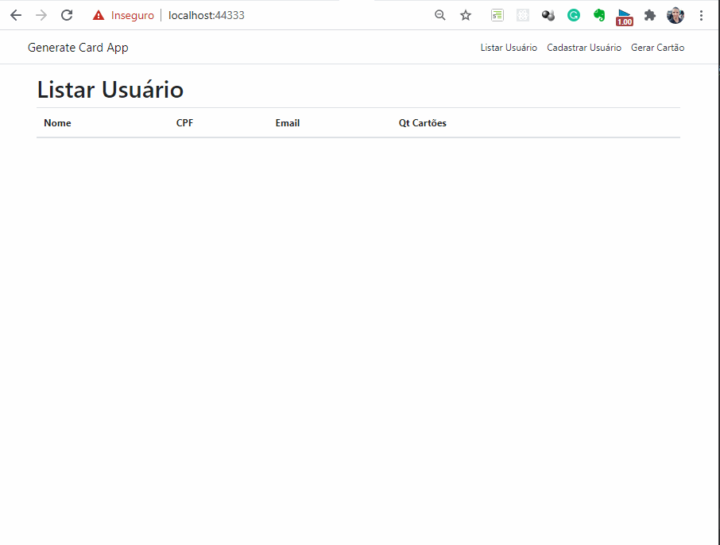

# Ambiente de Desenvolvimento

Para o Desenvolvimento da Aplicação foi utilizado o sistema operacional Windows 10

##### IDE's:

* [JetBrains Rider 2021.1.2](https://www.jetbrains.com/pt-br/rider/)
* [WebStorm 2021.1.1](https://www.jetbrains.com/pt-br/webstorm/)

##### Banco de Dados:

* [Banco de Dados Relacional MySQL Community](https://dev.mysql.com/downloads/mysql/)

# Criação da Aplicação

A aplicação foi criada com o auxilio do __Rider__ selecionando a opção ASP.NET Core Web Application deixando selecionado
as opção defaut, selecionando o Angular como Front-End.

#### Dependências

* Microsoft.AspNetCore.Mvc.NewtonsoftJson (para corrigir erros na serialização json)
* Microsoft.AspNetCore.SpaServices.Extensions (para levantamento da aplicação Front-end com Angular 8)
* Microsoft.EntityFrameworkCore (para todo o gerenciamento dos dados entre aplicação e banco de dados)
* Microsoft.EntityFrameworkCore.Tools (fornece ferramentas para a criação das migrations e atualização do banco de
  dados)
* MySql.EntityFrameworkCore (drive MySQL)
* Swashbuckle.AspNetCore (para a configuração do Swagger para a documentação e testes da API)

## Base da Aplicação

Foi criada uma base para as entidades do projeto com:

* IBaseEntity.cs - que estabelece um contrato para ser implementado pelas entidades do projeto, normalmente coloca-se
  nessa interface campos que se repetirão em todas as entidades do projeto, seguindo o principio "ISP — Interface
  Segregation Principle" do SOLID foi definido nessa classe a data de criação do objeto e a data de modificação.
* BaseEntity.cs - que consiste da implementação da IBaseEntity onde define as data corrente para os objetos no ato de
  sua criação.

Com isso o projeto está proto para começar a definir suas entidades.

User - Representa um usuário onde tem 4 campos:

* __Email__ do tipo string que será a primary key da tabela recebendo a notação [key] para o entity framework fazer o
  mapeamento no banco de dados.
* __Name__ do tipo string quer representa o nome do usuário.
* __Document__ do tipo string que representará no nosso sistema um documento de identificação do usuário. no Front-end
  será considerado um CPF.
* __Cards__ do tipo ICollection<Card\> que será onde os cartões do usuário serão armazenados.

Card - Representa um cartão de Credito contendo os atributos do mesmo

* __Id__ do tipo int, é a primary key do cartão.
* __Number__ do tipo string, onde é armazenado o número aleatório após sua geração.
* __Validate__ do tipo DateTime, onde se define a data de validade do cartão sendo essa estabelecida com 5 anos após a
  geração do cartão.
* __SecurityCode__ do tipo int, código de segurança CVV com três dígitos.
* __UserEmail__ do tipo string, onde faz a amarração do usuário com o cartão, no mapeamento relacional também é
  utilizado a notação  [ForeignKey("User")] para que o entity framework consiga fazer essa ligação com o Usuário.
* __User__ do tipo usuário, onde é utilizado no mapeamento do ORM.

####                 * Criação do Contexto

Após a criação do domínio foi definido o DbContext da aplicação que consiste dos domínios que o ORM ficará responsável
por gerenciar. Em seguida foi realizada a configuração do context no Startup da aplicação, para que o .NET gerencie o
contexto conectando-o no MySQL.

####                 * MySQL Connector

Com as etapas anteriores concluídas foi adicionado a URI de conexão do MySQL no appsettings.Development.json para que a
aplicação consiga se comunicar com a base de dados.

####                 * Criação das Migrations e Atualização do Banco de Dados

Após essas configurações utilizaremos o tools do Entity Framework no terminal para gerar as Migrations seguindo os
seguintes comandos:  
</br>
Add dotnet tools:

```console
dotnet new tool-manifest
```

Install dotnet tools:

```console
dotnet tool install dotnet-ef
```

Criar os scripts de Migração:

```console
dotnet ef migrations add Sample
```

Rodar os scripts para atualizar o banco de dados:

```console
dotnet ef database update
```

####                 * Configuração documentação API com Swagger

Depois foi adicionado as configurações do Swagger no Startup.cs onde definisse URI de acesso pelo Browser.

####                 * Repositories

Foi criada uma base de classes para abstrair as operações no banco de dados sendo elas compostas por

* __interface IRepository__ onde se define o contrato a ser adotado pela implementação.
* __abstract class RepositoryBase<TEntity, TContext>__ Utilizando de generics para ser estendida pelas classes
  especializadas, implementa-se o contrato com a IRepository.
* __Entidades Especializadas User e Card__ Com a base pronta cada classe deve criar sua interface para estipular os
  contratos específicos e uma classe que implementa esses contratos.

####                 * Injeção de Dependências

Foram adicionadas nos serviços do Startup as classes para que o Asp.Net Core gerencie as dependências, sendo assim não
precisaremos instanciar manualmente nossas dependências, deixando a cardo da aplicação as injetar pelo construtor,
facilitando a criação de testes unitários.

```c#
services.AddScoped<IUserRepository, UserRepository>();
services.AddScoped<UserService>();
services.AddScoped<ICardRepository, CardRepository>();
services.AddScoped<CardService>();
```

## Regras de Negócio e Criação das API's

Foi adicionado uma camada Service a aplicação para realizar as operações com o banco de dados e implementar o algoritmo
de geração do número aleatório do cartão de crédito.   
Também foi adicionada uma camada Controller onde os endpoints estão armazenados, fazendo o gerenciamento das requisições
Http e devolvendo objetos JSON respeitando a arquitetura REST.  
Nossa Api está no 2º nível do __modelo de maturidade de Richardson__ onde temos respostas personalizadas para cada tipo
de operação e também a utilização dos verbos HTTP (post, get, delete) para diferenciar o acesso aos endpoints.

####                 * Camada de Serviço

Na camada de serviço foi criado um método para cada endpoint fazer a comunicação com o banco de dados, fazendo as
operações solicitadas pelas requisições nos controllers, no CardService.cs há um método com as regras de negócios para a
geração dos números aleatórios do cartão. Nesse método utiliza-se as biblioteca Random e também um StringBuilder para
criar os números selecionando-os aleatoriamente entre os caracteres de '0' a '9'.
<br>
<br>
Pensou-se também em utilizar o algoritmo de Luhn para que a solução se aproximasse da realidade, porém com pouco domínio
da tecnologia .NET e com o curto prazo para entrega, cheguei a conclusão de que seria melhor aproveitado o tempo
estudando mais sobre o ambiente Asp.Net Core para conseguir uma solução.

####                 * Camada de Controle

Na camada de controle foi desenvolvido 4 endpoints para o usuário, com os recursos:

* Criação de usuário
* Busca por email, onde já trás do banco de dados todos os cartões cadastrados para o usuário.
* Delete, para exclusão de usuário através do seu email.
* Listar todos os usuários
  <br>
  <br>

Para o Cartão foi criados os seguintes endpoints:

* Criação de cartão, onde é passada uma string com o email do usuário que ficará vinculado ao cartão.
* Exclusão de cartão passando o Id do cartão que se deseja excluir.
  <br>
  <br>

####                 * Para Testar a API

O Swagger nos fornece uma fantástica ferramenta com toda a documentação da nossa API, com recursos para fazer
requisições para teste, com isso para testar basta entrar no navegador e fazer a chamada para
__URL_BASE/swagger/index.html__

[https://localhost:44333/swagger/index.html](https://localhost:44333/swagger/index.html)

Essa é a tela do Swagger com os endpoints descritos acima.


## Front-end

Para o front-end foi utilizado o Angular 8. Aproveitou-se o template gerado pela IDE na criação do projeto, foi
desenvolvido 3 componentes para consumir a API.

* Tela para cadastro de novos usuários;
* Listagem dos usuários com a quantidade de cartões;
* Detalhes do Usuário com a opção de gerar novos cartões e excluir cartões já gerados.

Abaixo segue a demonstração da aplicação em funcionamento.



## Conclusão

O tempo foi corrido para dar conta de tudo que eu pretendia fazer nesse projeto, porém ainda não consegui criar os
testes unitários nas camadas de serviço e controle, eu também pretendia fazer o deploy da aplicação na cloud, porém
também não foi possível, pois a plataforma que utilizo não trabalha com .NET e não sobrou tempo para aprender a fazer o
deploy na Azure.  
<br>
Com todos os percalços do caminho considero o resultado positivo, o projeto me ajudou a crescer muito
profissionalmente, pois foi um baita desafio, apesar do meu background ser do universo Java juntamente com os frameworks
Spring e Hibernate Jpa, está sendo muito bom aprender coisas novas. Agradeço de coração a oportunidade de participar
dessa seleção e minhas expectativas são de que eu consiga essa oportunidade para poder me desenvolver junto com a equipe
do Vaivoa.

Thank you!!


